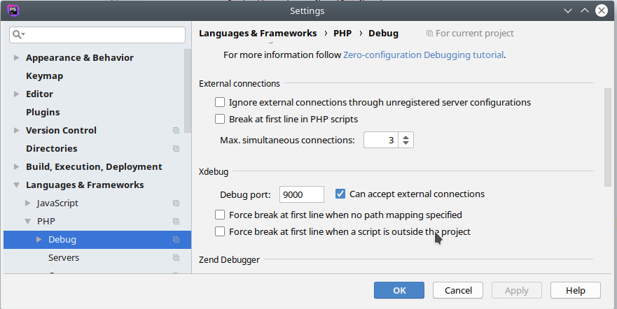

# kickstart-flavor gaia :: Apache2, PHP7.2 development container
[](https://github.com/infracamp/kickstart-flavor-gaia/actions)
[](https://github.com/infracamp/kickstart-flavor-gaia/releases)
[](https://github.com/infracamp/kickstart-flavor-gaia)

see (http://github.com/infracamp/kickstart) for more information.

Document Index:

- [Development Guide for this flavor](DEVELOPMENT.md)
- [Dockerhub page](https://hub.docker.com/r/infracamp/kickstart-flavor-gaia/)
    - [Tags available](https://hub.docker.com/r/infracamp/kickstart-flavor-gaia/tags/)
    - [Build details](https://hub.docker.com/r/infracamp/kickstart-flavor-gaia/builds/)


## Tags

| Tag         | Version                 |
|-------------|-------------------------|
| latest      | 7.2                     |
| testing     | 7.2                     |
| experimental| 7.2                     |
| 7.4-experimental | 7.4 **new**        |
| 7.4-testing      | coming soon        |
| 7.4-stable       | coming soon        |


## Container specific `.kick.yml`-directives

| Key | Default | Description |
|----------------|----------------|---------------------|
| `http_port`                  | `80`          | The internal port, apache listens on |
| `apache_www_root`            | `/opt/www`    | The document root |
| `apache_fallback_resource`   | `null`        | All requests will be redirected to this script. |
| `SYSLOG_HOST`                | ''            | Send apache2 error log to this host             |

## SIGTERM Trap
The container will catch SIGTERM signal and will gracefully shutdown if the webserver is idle or not responding

Steps executed when a SIGTERM signal is received

- Get the server status from the route /server-status
- Check the http response status code
    - if status code is not 200, terminate the container immediately(Web Server is already not responding)
- else (status code is 200), check in the http response body for requests being processed
    - if no requests are pending kill the container 
    - else sleep 2 seconds and start the steps from the beginning and will continue until the container is terminated with a SIGKILL signal

## Installed Software

Make sure your IDE has plugins installed for:

- **[editorconfig](https://editorconfig.org/#download)** 


### Using the xdebug debugger / profiler with PhpStorm

Xdebug is enabled by default if you are in development mode (the project is run by kickstart.sh)

Xdebug is configured to connect the IDE on the `Docker-Host-IP` (which is the first configured IP of your
host machine - determined by kickstart.sh) on Port `9000`

#### PhpStorm IDE settings (global) 

Activate remote debugging in **Settings**:



#### Project settings

Open *Run* > *Edit configurations...*


**The idekey and serverName is the name of your project!**

Enable Path Mappings:


> **Ensure `serverName`, `idekey` and `configName` is the same of your project name**


#### Start Debugging via browser

To start debugging via browser open:
```
http://localhost/?XDEBUG_SESSION_START=project123-name
```

#### Start CLI debugging

```
just set the breakpoint
```


#### Troubleshooting the debugging

If debugging won't work, use our checklist to determine the cause:

1) Check the docker-host's IP was propagated correctly.
    - The IP should be set as environment-variable `DOCKER_HOST_IP`
    - Inside the container type `echo $DOCKER_HOST_IP` should print your ip
    
    > A) Check kickstart.sh is the newest version (perform ./kickstart.sh --upgrade)
    
    > B) Solution: Check `hostname -i` returns your primary IP address on your
    > host machine.
    
2) Check the IDE is connectable from within the container on Port `9000` 
    - Install netcat and try the script below:
    ```
    sudo apt install netcat
    nc -zw3 $DOCKER_HOST_IP 9000 && echo "OK: IDE is reachable on port 9000" || echo "ERROR: IDE unreachable"
    ```
    > A) Check if you can reach this PORT from outside the container. If not your IP might be wrong,
    > or your IDE is not correctly configured.    
    
3) Check your IDE-Settings.